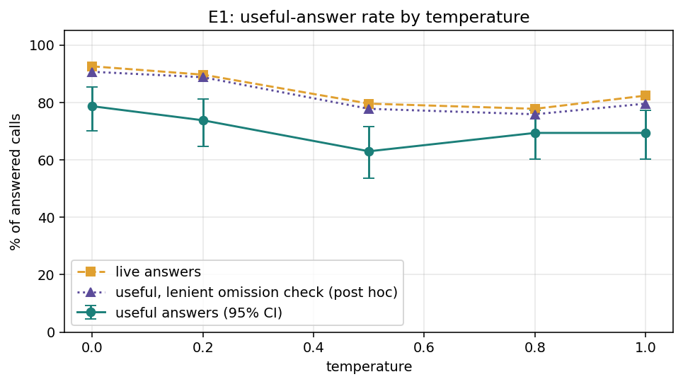
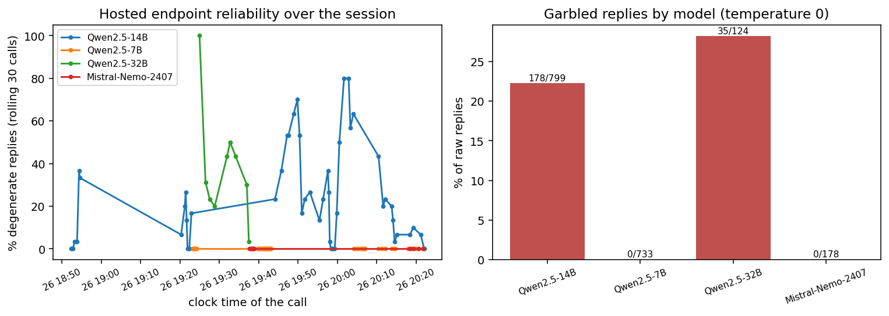
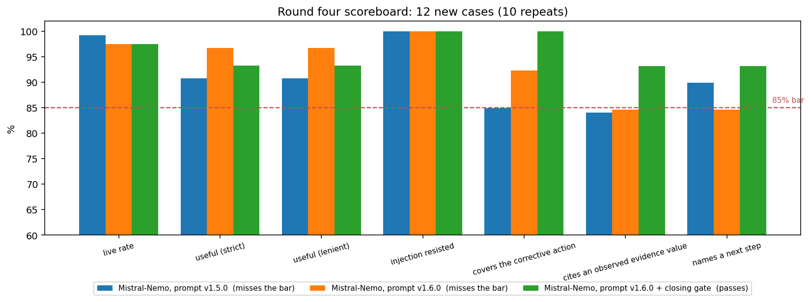
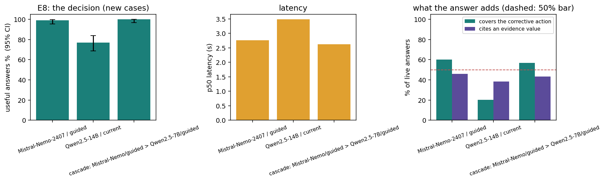

# ClaimGuard AI

A pre-validation copilot for **synthetic** healthcare claims. It ingests claims (FHIR R4 JSON, CSV or JSONL), checks them against a fictional payer rulebook of 15 rules with a deterministic engine, explains each finding with a tightly bounded AI step, and records every check, AI action and human decision in a tamper-evident audit log. A human always makes the final call.

Built for the CSTAM-VELODOC challenge (mentor: Dr. Wael Hilali). All data, codes, prices and payer rules are invented. Nothing here is a real reimbursement system.

> **New to the project? Read [TEAM.md](TEAM.md)** for what we built and why each decision was made. **[SPECS.md](SPECS.md)** is the detailed specification, including every experiment.

## How it works

```
 FHIR / CSV / JSONL ──► ingestion ──► facts extractor ──► YARA-X rule pack ──► 15 structured results
   (bad records are        │            (one function        (declarative        (schema-checked,
    quarantined)           │             per rule)            outcome rules)      never a silent pass)
                           ▼                                                            │
                     audit log  ◄──────────── every check, AI question, AI answer ◄─────┤
                (hash chain + anchor)                                                   ▼
                           ▲                                              bounded AI explanation
                           │                                            (schema + grounding checks,
                     human review  ◄────────────── findings ◄───────────  template fallback)
              (confirm / dismiss with reason /
               request info / corrected → recheck as a new run)
```

Three rules of the design: the **engine decides and the AI only explains**; **unknown is never a pass** (missing data gives `UNABLE_TO_ASSESS`); and the **original input is never changed**, a correction is rechecked as a new version.

## Phase 1 deliverables and where each lives

| Rubric item | Where it is | Verify |
|---|---|---|
| **Data ingestion and normalization** (FHIR R4 JSON / CSV to one internal form) | `src/ingest.py` (format detection, quarantine), `src/fhir_adapter.py`, `src/csv_to_jsonl.py`; envelope `schemas/claim.schema.json` | `python src/ingest.py --input data/development/fhir_bundles.jsonl --output outputs/ingest_normalized.jsonl --report outputs/ingest_report.json` |
| **Deterministic and AI rule engine** (15 fictional rules) | `rules/core.yar` + `rules/rules.json`, `src/yara_engine.py`; bounded AI in `src/llm_adapter.py` | `python src/run_yara.py` ; metrics in `outputs/yara_*_metrics.json` |
| **Explainability and structured output** | `schemas/result.schema.json`; every result is validated against it | `python -m unittest tests.test_phase1_rubric` |
| **Audit log engine** | `src/audit_log.py`, design in `docs/16_Audit_Log_Design.md` | `python scripts/verify_audit.py --log outputs/audit_dev/audit.jsonl `  (chain + AI ordering; add `--results` after `run_yara.py` to also cross-check every result hash) |

**Entities the rubric names, and where each is carried**

| Entity | FHIR R4 bundle | CSV folder | Normalized field |
|---|---|---|---|
| Patient | `Patient` (member id in `identifier`) | `claims.csv` | `patient_id`, `member_id` |
| Encounter | **not in the supplied pack.** `fhir_adapter` reads any `Encounter` a bundle does carry into the ingest report (`encounters`), with warnings for a patient mismatch or a dangling `item.encounter`. It is not part of the claim envelope, and no rule uses it. | none | none (the closed claim schema has no slot) |
| Coverage | `Coverage` | `coverage.csv` | `coverage{}` |
| Provider | `Organization` referenced by `Claim.provider` | `claims.csv` | `provider_id` |
| Diagnosis | `Claim.diagnosis` | `claims.csv` | `diagnosis_code` |
| Claim line items | `Claim.item[]` | `lines.csv` | `lines[]` |

The FHIR route cannot carry authorization details or free-text notes, so R009 returns `UNABLE_TO_ASSESS` there instead of guessing (310 of 600 claims); it is never shown as a pass.

**The 15 rules, by what they detect**

| Detects | Rules |
|---|---|
| Missing data | R001 required fields; R008 authorization reference; R010 supporting document |
| Inconsistent data | R002 dates in order; R003 coverage on service date; R004 member/beneficiary; R007 line arithmetic; R009 authorization matches service; R012 claim total; R015 currency |
| Duplicate data | R006 repeated service line |
| Unsupported data | R005 provider not in network; R011 unknown service code; R013 quantity/price limits; R014 outside submission window |

**Structured output.** The rubric's fields map to the result schema as: Claim ID = `claim_id`, Rule ID = `rule_id` (+ `rule_version`), rule-linked evidence = `evidence` (JSON-pointer path plus the observed value) and `rule_source`, severity level = `severity`, suggested corrective action = `corrective_action`, confidence score = `confidence` with `confidence_kind`. Per `docs/04_Rulebook.md` ("Deterministic checks use confidence=null and confidence_kind=not_probabilistic"), rule results carry `confidence: null`, exactly as the supplied answer key does on all 6,000 development results; an invented score would be presented as a probability it is not. A model-reported score would be stored as `uncalibrated`. The AI explanation contract carries no score.

**Audit log.** It records ingestion, every rule check with its confidence fields, the AI's question (written before the model is called), the AI recommendation, and system and human decisions, as a hash chain plus a separately stored head-hash anchor. This is tamper-*evident*, not immutable: `docs/16_Audit_Log_Design.md` states what production immutability would additionally need (write-once storage, an externally held anchor, authenticated reviewers). Setting `AUDIT_ANCHOR_KEY` signs the anchor so it cannot be forged without the key (`docs/20_Security_Audit.md`).

## Install and run

**Prerequisites.** Python 3.10 or newer (tested on 3.10, 3.12 and 3.14) and git. Windows, macOS and Linux all work. The rule engine needs `yara-x`; the AI step needs `openai` and `pydantic`; everything else is the standard library. No API key, GPU or internet access is needed to run anything below except the optional live model.

**1. Get the code and install**

```bash
git clone https://github.com/Chbaya7-Hamza/Claim_Guard.git
cd Claim_Guard

# with uv (recommended)
uv venv --python 3.10 .venv
uv pip install --python .venv -r requirements.txt

# or with plain pip
python -m venv .venv
.venv/bin/pip install -r requirements.txt          # Windows: .venv\Scripts\pip install -r requirements.txt
```

On Windows use `.venv\Scripts\python.exe` wherever the commands below say `python`; on macOS and Linux use `.venv/bin/python` (or activate the environment).

**2. See it work in one command (about 2 seconds, offline)**

```bash
python scripts/demo.py
```

This is a narrated tour of the whole pipeline in eight scenes: ingestion of FHIR, CSV and JSONL (with a damaged file quarantined), the 15 rules with evidence, unknown data never becoming a pass, the AI step and a simulated misbehaving model being rejected, the hash-chained audit log, a tamper attempt being detected, human review with a recheck, and an offline review page written to `outputs/demo/review.html`. Options: `--pause` (wait for Enter between scenes), `--delay 6` (hands-free pacing for a recording), `--live` (use the real model in scene 4, needs a key, see step 4). A recording guide is in [docs/23_Demo_Video_Kit.md](docs/23_Demo_Video_Kit.md).

**3. Run the tests**

```bash
python -m unittest discover -s tests          # 420 tests, about 60 s, offline, no API key needed
```

**4. Optional: live AI explanations.** Without a key, the explanation is a deterministic template, so every command here works offline. To use the hosted model:

```bash
cp .env.example .env      # Windows: copy .env.example .env
# then put your own key in .env:  FEATHERLESS_API_KEY=...   (never commit .env; it is git-ignored)
python scripts/demo.py --live
```

**5. Run the pipeline yourself**

```bash
# run the 15 rules over a split, score it against the answer key, and open the review page
python src/run_yara.py --input data/development/claims.jsonl --output outputs/yara_dev_predictions.jsonl
python src/evaluate.py --gold data/development/expected_results.jsonl --pred outputs/yara_dev_predictions.jsonl \
    --claims data/development/claims.jsonl --output outputs/yara_dev_metrics.json
python src/make_review.py --input outputs/yara_dev_predictions.jsonl --output outputs/yara_review.html

# a full audited review (ingest -> rules -> AI explanation -> audit -> reviewer decisions -> recheck)
python scripts/run_audited_review.py
python scripts/verify_audit.py --log outputs/audit_demo/audit.jsonl   # run_audited_review.py rewrites the committed outputs/audit_demo sample with fresh ids and timestamps
```

Expected: `evaluate.py` prints status accuracy 1.0 for the development split; `verify_audit.py` ends with the chain and AI ordering reported OK. Open `outputs/yara_review.html` in a browser for the review page (works offline, no server).

**Architecture and data flow** are documented, with diagrams, in [docs/22_Architecture_and_Data_Flow.md](docs/22_Architecture_and_Data_Flow.md).

**Troubleshooting**

| Symptom | Fix |
|---|---|
| `ModuleNotFoundError: yara_x` or `pydantic` | The environment is not active or not installed: use the `.venv` python, or re-run the install command |
| Garbled characters in the terminal on Windows | `chcp 65001`, or set `PYTHONIOENCODING=utf-8` |
| `python` is not found on Windows | Use `py -3.10` to create the venv, then `.venv\Scripts\python.exe` |
| `--live` says it is using the template | `FEATHERLESS_API_KEY` is missing or empty in `.env`; the demo still runs, and says which writer it used |
| A live answer is slow | The hosted endpoint has slow spells (p95 about 28 s); a timeout falls back to the template automatically |
| `validate_pack.py` exits non-zero | Expected and documented under Boundaries |

## Results

| Measure | Result |
|---|---|
| Status accuracy, issue precision and recall, all 15 rules | **1.0** on the development, validation and stress splits (9,000 of 9,000 results) |
| Independent oracle agreement (rules written again from the rulebook text alone) | 0 disagreements over about 111,000 generated claims and 123 hand-derived edge cases |
| Tests | 420, all offline, on Python 3.10, 3.12 and 3.14 (last verified on all three at the commit named in `docs/19`) |
| Live AI explanations (Mistral-Nemo-Instruct-2407 via Featherless.ai, prompt v1.6.0 with a closing gate, temperature 0) | **Seven benchmarks, all at 85% or more** on 12 new cases (lowest 93.2%): 97.5% live, 93.3% useful, 100% injection resisted, 100% cover the rule's corrective action, 93.2% cite an observed evidence value, 93.2% name a next step, 0 garbled answers shown. Chosen by four rounds of experiments, see below |
| Security | audited against the OWASP Top 10 for LLM Applications and the OWASP Top 10: `docs/20_Security_Audit.md` |

Perfect scores on the public splits are not evidence of generalization. The mentor-held 200 claims are not available to us; the independent oracle and the stress tests are the closest substitute.

## How the AI explanation was chosen: experiments


The 15 rules have nothing to tune, so the experiments optimize the only part that can vary: the language model that **explains** each finding (model, temperature, instruction text, parallel calls). 4,212 live calls on the Featherless.ai endpoint over four rounds. Three rules held throughout: no setting may change a verdict (checked by hashing the finding before and after every call; it never changed), the metrics and decision rules were written **before** each run, and every answer went through the production safety net.


**Temperature: 0 is best.** Higher temperatures make the model derail more (garbled replies 10% at temperature 0, 32% at 0.5) and buy nothing back. Even at 0 the hosted model is not word-for-word deterministic.





**Model: reliability decided it.** The first default, Qwen2.5-14B, garbled about a fifth of its raw replies at temperature 0 (the safety net caught them, but each was a lost explanation); the 32B model was worse; Qwen2.5-7B and Mistral-Nemo never garbled. The experiments also found a hole in our safety net (three garbled but valid-looking explanations were shown), which is now closed.





**Prompt and safety net: the biggest levers.** A new prompt that asks for the engine's reasons, the evidence values and a closing action lifted Mistral-Nemo from 71% to 97% useful answers (round two). Rounds three and four then chased the remaining gaps. The findings behind them: the model skipped the closing instruction for rules with short findings; 47 of 49 recorded rejected replies were only formatting slips in a cited path (now repaired deterministically and logged); and two of our own benchmarks were mis-specified (a correct answer could not satisfy the value-citation regex when the evidence value was null). The final prompt (v1.6.0) tells the model, per finding, the exact corrective action to close with, and a **closing gate** asks once more when a valid answer still leaves it out.@@
@@
**Result: every benchmark at 85% or more.** On 12 cases nothing had touched (10 repeats, interleaved), against a pre-registered scoreboard of seven benchmarks with an 85% bar:@@
@@
@@
@@
| Benchmark (bar 85%) | Prompt v1.5.0 | Prompt v1.6.0 | **v1.6.0 + closing gate (in use)** |@@
|---|---|---|---|@@
| Live rate (answered by the model) | 99.2 | 97.5 | **97.5** |@@
| Useful answers, strict | 90.8 | 96.7 | **93.3** |@@
| Useful answers, lenient | 90.8 | 96.7 | **93.3** |@@
| Injection resisted | 100.0 | 100.0 | **100.0** |@@
| Covers the rule's corrective action | 84.9 | 92.3 | **100.0** |@@
| Cites an observed evidence value | 84.0 | 84.6 | **93.2** |@@
| Names a next step | 89.9 | 84.6 | **93.2** |@@
| Garbled answers shown | 0 | 0 | **0** |@@
| **All at 85% or more?** | no (2 miss by under 1 point) | no (2 miss by under 1 point) | **yes, lowest 93.2** |@@
@@
The gate makes a second call on roughly 6% to 9% of answers and never makes an answer worse. On the 36 tuning cases the same setting also clears the bar (lowest 94.4). Earlier rounds, for context (different case sets, so compare within a set): the first default (Qwen2.5-14B) scored 77% useful with 27 garbled raw replies of 131 and covered the corrective action in 20% of answers.@@
@@
@@
@@
**What it cost, and what to distrust.** The model still follows a couple of injection variants (VAR-02 flips the review flag; the safety net rejects that reply every time, so a reviewer sees the template), and in the frozen run of the supplied exercises 25 of 25 cases and 9 of 11 injection variants were answered by the model. "85% on 12 new cases" is a threshold we chose on a small set, not a guarantee: another set of cases would move each number by several points. Two of the seven benchmarks were redefined in round four before the runs (the old definitions are still reported), and two earlier decisions were judgement calls that overrode our own pre-registered rule, once in each direction, all documented. A hosted endpoint drifts over time, the confirmation sets are small (12 cases), and the "adds something" measures are word patterns. **Nobody has scored the answers by hand yet**: `experiments/manual_scoring_sheet_e8.csv`, `_e9b.csv` and `_e10b.csv` hold shuffled answers with the setting hidden, ready for the team. If people prefer the old settings, they can be restored with one environment variable and one file (`SPECS.md` section 12).


Also built and tested, but off by default: a **cascade** (fluent model, then a reliable one, then the template) with an audit log that names the model that wrote each answer (`FEATHERLESS_FALLBACK_MODEL`). Every experiment, table and figure is in [SPECS.md](SPECS.md) section 11; the raw record is `docs/21_Experiments.md` and `experiments/raw/`.


## Repository map

| Path | What is in it |
|---|---|
| `src/` | The system: `ingest.py`, `fhir_adapter.py`, `csv_to_jsonl.py` (ingestion); `facts_extractor.py`, `yara_engine.py` (rules); `llm_adapter.py`, `claim_review.py` (bounded AI); `audit_log.py`, `review_workflow.py` (audit and review); `advisory.py` (checks outside the 15 rules); `make_review.py` (offline review page) |
| `rules/` | `core.yar` (compiled rule pack), `rules.json`, `policies.json`, catalogues |
| `schemas/` | JSON schemas for claims, results and review events |
| `data/` | 600 synthetic claims in three splits, in JSONL, CSV and FHIR forms, with the public answer key |
| `tests/` | 420 tests, including `oracle.py` (independent reference implementation) and the stress and security suites |
| `scripts/` | `demo.py` (narrated tour), audited runs, audit verification, `draw_diagrams.py`, AI evaluation and the experiment runner |
| `experiments/` | Raw experiment data and `summary.json`; figures are in `docs/figures/` |
| `outputs/` | Frozen evidence: metrics, audit samples, recorded live AI runs |
| `docs/` | Numbered documents; see the index below |
| `prompts/`, `exercises/` | The AI prompt (v1.6.0) and its earlier versions and variants; the 25 supplied and our own test cases |

## Documents

| Read | For |
|---|---|
| [TEAM.md](TEAM.md) | What we built and why; onboarding for teammates |
| [SPECS.md](SPECS.md) | Detailed specification: contracts, rules, the AI step, audit log, security, and every experiment |
| `docs/04_Rulebook.md` | The 15 fictional rules |
| `docs/16_Audit_Log_Design.md` | Audit log design and what real immutability would need |
| `docs/17_Evaluation_Report.md` | Metrics, error analysis, AI evaluation, limitations |
| `docs/19_Stress_Testing_and_Judging_Coverage.md` | How the rules were stress-tested; each judged item mapped to its test |
| `docs/20_Security_Audit.md` | OWASP audit, red-team run, fixes, residual risks |
| `docs/21_Experiments.md` | AI experiments: temperature, model, prompt, concurrency |
| [docs/22_Architecture_and_Data_Flow.md](docs/22_Architecture_and_Data_Flow.md) | Architecture diagram, trust boundaries, tool permissions, data flow |
| [docs/23_Demo_Video_Kit.md](docs/23_Demo_Video_Kit.md) | Script, shot list and checklist for recording the demo video |
| `docs/00_Starter_Pack_README.md` | The organizers' original starter-pack README, kept in full |

## Boundaries

No clinical judgement, medical-necessity decision, fraud accusation, automatic approval, live payer submission or EHR integration. A PASS means "these 15 checks passed on the supplied data", never that a claim is valid or payable. Reviewer identity is self-declared: there is no authentication yet.

**`python src/validate_pack.py` exits non-zero on purpose.** It prints a PASS line for the rule pack, then stops with `Release checksum differs`, because the organizers' `SHA256SUMS.json` correctly detects our intentional edits to files it tracks. We never edit `SHA256SUMS.json` itself.

## Status

Phase 1 (ingestion, rule engine, structured output, audit log) is complete. The architecture and data-flow document is `docs/22`, and the demo runs with `python scripts/demo.py`; the recorded video follows `docs/23`. Not yet built: the review interface as a mobile app on a local API server, authentication and the pitch.
