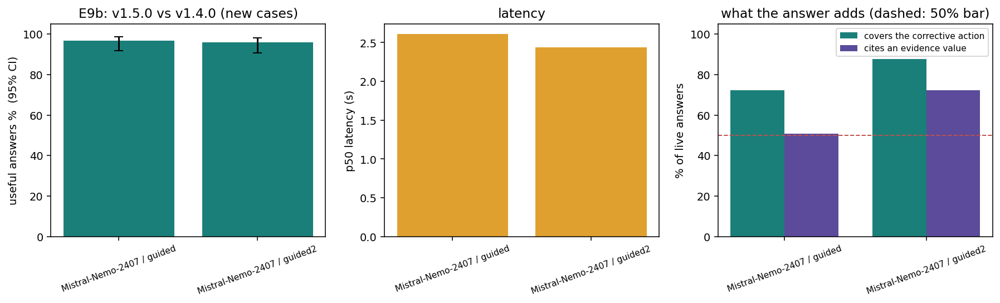
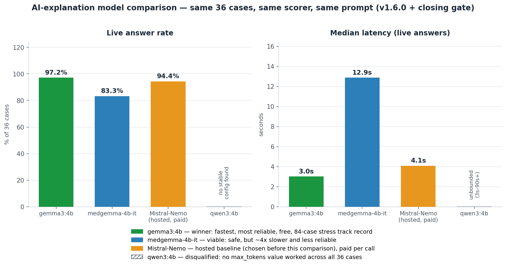

# TEAM.md: what we built, and on what grounds

For everyone on the team, including anyone who joins later. The [README](README.md) says how to run things. This file says **what the system is, why it is shaped this way, how we know it works, and where it is weak.** Where a claim rests on evidence, the evidence is named so you can check it.

## 1. The system in one page

**The problem.** Insurance claims are often rejected because of avoidable defects: a missing field, dates in the wrong order, a total that does not add up, an expired authorization. A reviewer wants those found before submission, with the reason and the evidence, and wants to stay in control.

**What we built.** A pipeline for **synthetic** claims and a **fictional** payer rulebook (15 rules):

1. **Ingest** claims from FHIR R4 bundles, CSV folders or JSONL into one internal format. A bad record is quarantined with a reason; it never stops the batch and never becomes a "pass".
2. **Check** each claim against the 15 rules with a deterministic engine. Every result has a Claim ID, Rule ID and version, severity, the evidence (a pointer into the claim plus the observed value), an explanation and a corrective action.
3. **Explain** each FAIL or UNABLE_TO_ASSESS finding in plain language with a small language model that can only *explain*: it cannot change a verdict, and any reply that breaks the schema or invents facts is thrown away and replaced by a fixed template.
4. **Review.** A human confirms, dismisses (with a reason), requests information or marks a correction. A corrected claim is rechecked as a **new run**; the original is never edited.
5. **Record.** Every check, AI question, AI answer, system decision and human decision goes into a hash-chained audit log. The AI's question is written *before* the model is called.

**Three rules everything else follows from:**

| Rule | Why |
|---|---|
| The engine decides; the AI only explains | The rubric's non-negotiable checks say a model failure must not remove a finding. A verdict must be reproducible and explainable line by line; a language model cannot promise that. |
| Unknown is never a pass | Missing or unusable data gives `UNABLE_TO_ASSESS`. A green result on data we could not check is the most damaging thing this system could do. |
| The original input is never changed | An auditor must be able to see exactly what was submitted and what was decided about it. |

**What it is not.** Not a real reimbursement system: no clinical judgement, no medical-necessity decision, no fraud accusation, no automatic approval, no payer submission. A PASS means "these 15 checks passed on the supplied data", nothing more.

## 2. The team and how we worked

The repository does not record who the team members are or who did what, so **nothing is invented here.** Fill this in (and `docs/18_Contribution_Log.md`, which the challenge requires):

| Team member | Role | What they did | Evidence (commits, reviews) |
|---|---|---|---|
| _to fill in_ | _to fill in_ | _to fill in_ | _to fill in_ |
| _to fill in_ | _to fill in_ | _to fill in_ | _to fill in_ |

**AI coding tools.** The code was written with Claude Code (Anthropic) under the team lead's direction, 2026-09-21 to 2026-09-26. The team lead chose the architecture (a compiled YARA-X rule pack fed by a fact extractor), supplied the four graded Phase 1 deliverables, chose the model provider, and decided what to prioritize (Phase 1 first, then stress testing, security, experiments; the mobile app and local API are a later phase). A separate reviewer model was consulted before large design choices. The full account is in `docs/18_Contribution_Log.md`.

**Be clear-eyed about one thing:** the checks on that AI-written code are mostly automated (tests, an independent oracle, the organizers' answer key, red-team runs). A human reading of the code is **not recorded anywhere** in the repository. Someone on the team should review the modules and write down what they reviewed.

## 3. What is in the box

| Part | Files | Job | Why it exists |
|---|---|---|---|
| Ingestion | `src/ingest.py`, `fhir_adapter.py`, `csv_to_jsonl.py`, `jsonl_reader.py` | Turn three input shapes into one claim format; quarantine bad records | Rubric item 1. The FHIR route reads only what a bundle carries and leaves the rest unknown instead of guessing |
| Fact extractor | `src/facts_extractor.py` | One function per rule: reads the claim, returns facts, evidence paths, affected lines and a message | One place computes what a rule saw, so the rule pack and the result text cannot drift apart |
| Rule pack | `rules/core.yar` (YARA-X) | Declarative outcome rules: FAIL, UNABLE, NOT_APPLICABLE or PASS from the facts | The team lead's architecture choice; the outcome logic is data you can read, separate from the code that gathers facts |
| Engine | `src/yara_engine.py` | Compile, scan, resolve precedence (FAIL over UNABLE over NOT_APPLICABLE over PASS), assemble results, isolate a crashing rule | A rule that crashes becomes UNABLE for that rule only; a rule with no outcome stops the run loudly |
| Bounded AI | `src/llm_adapter.py`, `claim_review.py`, `prompts/` (v1.6.0 in use; v1.3.0 to v1.5.0 and experiment variants kept) | Explain findings with a model (optionally a cascade of tiers); validate every reply; fall back to a template | Rubric item 2 (AI half) and the grounding requirement |
| Audit log | `src/audit_log.py`, `audit.py` | Hash chain, separate anchor, write-ahead AI records, duplicate-submission and advisory events | Rubric item 4 |
| Review workflow | `src/review_workflow.py`, `make_review.py` | Validated decisions, unresolved counts, recheck as a new run, offline review page | MVP items 4 and 5 |
| Advisories | `src/advisory.py` | Flag defects none of the 15 rules cover (unknown diagnosis code, payer mismatch) | Found by red-teaming; kept outside the scored rules on purpose |
| Verification | `tests/` (see the README for the count), `tests/oracle.py`, `scripts/` | Prove and re-prove all of the above | See section 5 |

## 4. Decisions and their grounds

| Decision | Grounds | Trade-off or caveat |
|---|---|---|
| Deterministic engine, AI explains only | Rubric non-negotiables; a verdict must be reproducible | Explanations can be plain but shallow; a model cannot find defects the rules do not define |
| Fact extractor plus a compiled YARA-X pack | The team lead's architecture. First proven equal to the organizers' three-rule baseline, then extended one rule at a time (`docs/superpowers/specs/`) | The pack matches text by substring. A claim value like `USD R009:MISMATCH:` once forged a finding on another rule; fixed by encoding all claim data before it enters a fact (`docs/20`, finding F1) |
| Precedence: a proven violation beats a missing input | `docs/04` shared conventions | Found missing in R009 and R013 by the independent oracle; fixed |
| `confidence` is null for rule results | `docs/04` says deterministic checks carry `confidence: null`; the organizers' answer key does the same on all 6,000 development results | A grader who expects a number will ask. An invented score would pretend to be a probability |
| Missing or invalid data is `UNABLE_TO_ASSESS`, never a guess | `docs/04`; the FHIR route cannot carry authorizations, so R009 is UNABLE there (310 of 600 claims) | More work for reviewers; correct by construction |
| Fail closed everywhere | A claim that breaks the input contract still gets 15 UNABLE results; a rule that crashes becomes UNABLE; a model failure falls back to the template | A run that "succeeds" with warnings must be read, not ignored (`run_yara` exits with code 2 then) |
| Trust boundary for the AI in the orchestrator | A red-team style test showed a pluggable provider could edit the finding it explained (a FAIL became a PASS) and could return unchecked replies. Now every reply is validated and providers get copies | Double validation for the built-in provider; cheap |
| Featherless.ai, open-weight `mistralai/Mistral-Nemo-Instruct-2407` with prompt v1.6.0 and a closing gate, temperature 0 | The first provider's key was withdrawn as untrusted; an open-weight model behind an OpenAI-compatible API keeps us swappable. Model and prompt were chosen by two rounds of experiments (`docs/21`): no garbled replies, full injection resistance, covers the rule's corrective action. Adopted by judgement after the pre-registered rule found no arm meeting every criterion | Synthetic data only. With real patient data this sends PHI to a third party; needs a data-processing agreement or an on-premise model (`docs/20`, LLM02). A hosted endpoint drifts, so the template floor and an optional second tier (`FEATHERLESS_FALLBACK_MODEL`) exist |
| Hash-chained audit log with a separate anchor | Tamper evidence for edits, deletions and truncation; the AI question is logged before the call | Whoever can write the files can rewrite chain and anchor together. `AUDIT_ANCHOR_KEY` signs the anchor to prevent that; the default is unkeyed. Not immutable storage |
| Ingestion quarantines instead of aborting | A held-out file may hold anything (BOM, bad bytes, giant numbers, a U+2028 in a value) | Every quarantined record must be counted and explained (it is) |
| Test against an independent oracle, not only the answer key | A 100% score on 600 public claims cannot show correctness on unseen data | The oracle was written by the same team from the same text; a shared misreading would survive (`docs/19` section 4) |
| Advisories are separate from the 15 rules | The rulebook fixes the scored set, so a new rule would change scored output | They only route a claim to a human; they never change a status |

## 5. How we know it works

Six layers of checking, from cheap to demanding. Each layer found real defects that the earlier ones missed.

| Layer | What it shows | Result |
|---|---|---|
| The organizers' answer key | Every rule agrees with the supplied labels | 9,000 of 9,000 results on development, validation and stress; precision, recall and status accuracy 1.0 |
| Worked examples | The handbook's own ten cases | Exact match |
| Independent oracle | A second implementation of the 15 rules from the rulebook text alone (`tests/oracle.py`) agrees with the engine | 0 disagreements over about 111,000 generated claims and 123 hand-derived boundary cases. It first found precedence bugs in R009 and R013, an exact-versus-rounded amount question, and a Python-version-dependent date parse |
| Hostile inputs at every entry | Files, bundles, CSV, the review page, the audit log | Found: a BOM losing the first claim, a 4,300-digit integer aborting a run, a U+2028 breaking an audit log, malformed FHIR aborting ingestion |
| Security audit | OWASP Top 10 for LLM Applications and the OWASP Top 10 | Found: claim data forging findings through the rule facts; unbounded prompts; log forging; a forgeable audit anchor (`docs/20`) |
| Red team | 30+ attacks through the real audited pipeline | No claim that broke a rule got through unflagged. Found: replays went unnoticed; defects outside the 15 rules passed cleanly. Both fixed |

The lesson: **a passing score is a claim, not a proof.** Every layer above the answer key existed because the layer below could not see a whole class of failure.

## 6. Experiments: can we make the AI step better?

The rules score 1.0 and have nothing to tune, so the only optimizable part is the explanation step: which model, what temperature, what instruction text, how many parallel calls. We wrote the metrics and the decision rule **before** running anything (`docs/21_Experiments.md`), ran everything through the production path, and checked that no setting ever changed a verdict.

We ran four rounds of experiments on the Featherless.ai endpoint (2026-09-26, 4,212 live calls). **Round one** asked which temperature, model and prompt were best; **round two** tried to settle the choice by combining what worked; **round three** improved how often an answer points at the rule's corrective action; **round four** asked for every benchmark to be at 85% or more.

**The model in use now: Mistral-Nemo-Instruct-2407, prompt v1.6.0 with a closing gate, temperature 0, with the deterministic template as the floor.** On 12 cases nothing had touched, all seven pre-registered benchmarks are at 85% or more (the lowest is 93.2%).

| Question | Answer | Evidence |
|---|---|---|
| Does any setting change a verdict? | **No.** The finding was hashed before and after every call; identical everywhere | `experiments/summary.json` |
| Which temperature? | **0.** Best on every quality measure; live answers fall from 93% to 78 to 82% at 0.5 to 1.0 and garbled replies rise from 10% to 32% | E1,  |
| Is temperature 0 deterministic? | **No.** On the hosted 14B model only 1 of 30 cases repeated word for word | E1 |
| Which model? | The old default, Qwen2.5-14B, garbled about a fifth of its raw replies at temperature 0 (the safety net caught them, but each was a lost explanation). Qwen2.5-7B and Mistral-Nemo never garbled; the 32B model was worst | E2,  |
| Which prompt? | The prompt matters more than the model. A short prompt makes models copy the engine's sentence; the new v1.4.0 prompt asks for every reason, the evidence values and a closing action, and lifted Mistral-Nemo's useful rate from 71% to 97% and its coverage of the rule's corrective action from 22% to 79% | E3, E7 |
| Can we combine the best of each? | A **cascade** (fluent model, then a reliable one, then the template) is built, tested and audit-logged, and can be switched on with `FEATHERLESS_FALLBACK_MODEL`. It is not the default: in the decisive run the first tier answered 120 of 120 calls, so the second tier is untested in a real failure | `tests/test_cascade.py`, E8 |
| Can the answer point at the corrective action more often? | Yes. The model skipped the closing instruction for rules with short findings (R005, R008, R009, R014), so v1.5.0 makes the three-sentence shape mandatory and adds a short-finding example. On 12 cases nothing had touched it raised coverage of the corrective action from 72% to 88% and value citation from 51% to 72% at unchanged useful rate, and **passed every pre-registered criterion, so this adoption is by the rule, not an override**. The cost: on the 36 tuning cases it gets more replies rejected (12 against 4) and the model follows one known injection (VAR-02), which the safety net rejects every time | E9a, E9b,  |
| Is every benchmark at 85% or more? | **Yes, with the final setting, on 12 new cases (10 repeats): live 97.5, useful 93.3, injection resisted 100, covers the corrective action 100, cites an observed evidence value 93.2, names a next step 93.2, 0 garbled shown.** It took three changes: a deterministic repair for formatting slips in cited paths (47 of 49 recorded rejections), a prompt (v1.6.0) that tells the model the exact corrective action to close with, and a **closing gate** that asks once more when a valid answer still leaves it out (about 6% to 9% of answers). Two benchmarks were mis-specified and were redefined before the runs (the old definitions are still reported). By the pre-registered rule, no override | E10a, E10b,  |
| Round-two comparison on 12 new cases (10 repeats) | Mistral-Nemo + v1.4.0: 99% useful, 0 garbled replies, 100% injection resistance, 2.8 s median. The old default: 77% useful, 27 garbled raw replies of 131, covers the corrective action in 20% of answers (60% for the new one) | E8,  |
| Parallel calls | 8 workers are fine (Mistral-Nemo: 164 calls per minute, no failures); the endpoint itself is noisy | E4 |

**How the round-two decision was made, honestly.** We wrote the rule before running: an arm is adopted only if it meets six criteria. **No arm met all six**: Mistral-Nemo with the new prompt cited an evidence value in 45.8% of answers against a 50% bar. Under the rule, the old default would stay. **We overrode the rule and adopted it anyway**, as a judgement, because the arm beats the default on every measured dimension including that one (45.8% against 38.5%), the default fails three criteria to its one, and the bar was set before we knew what was achievable, using a crude word pattern. This is the second time the rule and our judgement parted (in round one we declined to adopt a setting that met the rule, because its answers just copied the engine's sentence). Both are recorded in `docs/21_Experiments.md`. Two safeguards: the change is one setting away from being undone (`FEATHERLESS_MODEL=Qwen/Qwen2.5-14B-Instruct`, and the old prompt is frozen in `prompts/variants/v1_3_0.md`), and **`experiments/manual_scoring_sheet_e8.csv` holds 150 shuffled answers with the arm hidden for the team to score by hand. If people prefer the old default, revert.**

**What the experiments changed in the product:** the garbled-output guard (three gibberish explanations passed the schema and grounding checks and were shown as normal answers), the cascade with per-tier validation and audit logging, the default model, the prompt (v1.4.0, v1.5.0, then v1.6.0), the citation repair and the closing gate.

**How to read these results.** The primary metric is a mechanical check that rewards echoing the template and flags harmless paraphrases; we kept it as pre-registered, reported a lenient version beside it, and added measures for what an answer adds. A hosted endpoint drifts over time (the same configuration scored 78.7%, 76.9% and 59.8% in three runs), so only the interleaved experiments (E5 to E8) compare fairly. The prompt was written while looking at tuning-set answers, and the confirmation set is only 12 cases. Everything, including the threats to validity and every deviation from the plan, is in `docs/21_Experiments.md`; raw replies are in `experiments/raw/`.

### 6a. Local models: can we drop the paid, hosted call entirely?

Everyone in this challenge has the same rulebook and the same data, so the team looked for a differentiator: a
model that runs entirely on the reviewer's own machine, free per call, no internet dependency -- closer to how a
real hospital would want to deploy this. Same 36-case tuning set, same scorer, same prompt (v1.6.0 + closing gate)
as the Mistral-Nemo numbers above, so the comparison is direct, not a separate methodology:

| Question | Answer |
|---|---|
| Which local model won? | **`gemma3:4b`, run through Ollama on the reviewer's own GPU.** 97.2% live (35/36, beats Mistral-Nemo's 94.4%), 3.0 s median latency (Mistral-Nemo: 4.1 s), and it is the only local candidate with a full 84-case stress-test track record: 0 garbled replies, and its one rejection was a genuine hallucinated rule citation the schema caught, not a formatting slip |
| What about MedGemma (medical-domain-tuned)? | Works, safe (ties on grounding and injection resistance), but ~4x slower (12.9 s median) and less reliable (83.3% live) -- a real bitsandbytes 4-bit attention-kernel bug caused two of its rejections, not a quality problem with the model's answers |
| What about Qwen3 (asked for by name)? | **Disqualified, but not for quality.** It defaults to a hidden "thinking" mode neither documented way to disable actually turns off through Ollama's packaging of it. Three separate runs at `max_tokens` 500, 3000 and 8000 each found cases that still failed -- empty output, a schema-shape rejection, or a 90-second timeout -- with no single value that worked across all 36 cases. Its resource needs are unpredictable per case, which is a worse, less fixable problem than being merely slow |
| Does the safety net still hold for a local model? | Yes -- `OllamaExplanationProvider` and `MedGemmaExplanationProvider` go through the exact same schema, grounding and fallback checks as the hosted providers; nothing about the trust boundary changes for a model that happens to be free |
| Is this a final verdict? | No -- same caveat as Mistral-Nemo: these are automated checks (live rate, grounding, latency), not the manual 0/1 scorecard for correctness. `gemma3:4b` is the strongest candidate on everything a script can measure; whether it is as good at the substance is the same open question the hosted model still has |

Full write-up, including the exact fault-injection tests and the MedGemma chat-template mismatch that turned out to
be a bug in a third-party GGUF conversion and not the model: `SPECS.md` section 6a.

## 7. What we got wrong, and what to remember

- **We trusted the score.** Perfect public scores hid two precedence bugs and a rounding ambiguity until an independent oracle looked.
- **We checked statuses, not content.** The accuracy gate cannot see a change to a result's evidence. A fix to R009 silently changed three results' hashes; only the audit cross-check noticed. There is now a test that pins every logged result hash.
- **Our safety net had a hole we only saw by measuring.** Garbled model output (valid JSON, gibberish text) passed both checks until the experiments counted it. A guard is only as good as the failures you have looked for.
- **We put a safety check inside one class.** The schema and grounding checks lived in the built-in provider, so any other provider bypassed them. Safety checks belong in the orchestrator.
- **We let a metric flatter or punish without checking it.** The pre-registered "omitted reason" check flags paraphrases (most of the 30 flagged answers we read were fine), and it rewards near-copies of the template. We kept the original number and reported a lenient one beside it.
- **Small habits that mattered:** exact version pins, no `subprocess` or `eval` in our code (a test scans for it), `%r` in log calls, ASCII-escaped JSONL rows.

## 8. Known limits and what comes next

| Limit | Status |
|---|---|
| No authentication; reviewer identity is a typed name | Top residual risk; belongs with the local API and mobile app (next phase) |
| Review page is a static HTML file; decisions travel as a downloaded JSONL and recheck is a command | Next phase: the review interface as a mobile app on a local API server |
| The mentor-held 200 claims are unavailable | The oracle and stress tests are the substitute |
| Live AI answers not yet scored by a person | Open, and now the most valuable missing evidence. `experiments/manual_scoring_sheet_e8.csv` (150 shuffled answers, arm hidden) is ready; if people prefer the old default, revert the model and prompt (`docs/21`) |
| Audit log tamper-evident, not immutable | Set `AUDIT_ANCHOR_KEY`, keep the anchor elsewhere, use write-once storage for real immutability (`docs/16`) |
| Demo video and pitch | The demo runs with `python scripts/demo.py`; the video is to be recorded from `docs/23_Demo_Video_Kit.md`. The pitch is not yet made |
| No overall budget cap on paid model calls | Documented (`docs/20`, LLM10) |

## 9. Working in this repository

**Set up and check** (see the README for details): `uv venv --python 3.10 .venv`, `uv pip install --python .venv -r requirements.txt`, then `python -m unittest discover -s tests`. It must pass, offline, before you push.

**Changing a rule.** The rulebook (`docs/04`, `rules/rules.json`) is the authority, not the code. Change `facts_extractor.py` and `rules/core.yar` together, add the case to the boundary table in `tests/test_stress_boundaries.py`, and run the differential tests: if the oracle disagrees, re-read the rulebook and decide which side is wrong before editing either. Then re-run `python scripts/verify_audit.py --log outputs/audit_dev/audit.jsonl --results outputs/yara_dev_predictions.jsonl` (after `run_yara.py`); a mismatch means you changed a result's content and the frozen audit sample needs regenerating on purpose.

**Contributing.** `main` is protected: nobody pushes to it directly. Work on a branch, open a pull request, and wait for the CI checks (build, tests on Python 3.10, 3.12 and 3.14, rule accuracy against the answer key, and a security job with the adversarial suites, bandit, pip-audit and a secret scan) and for the owner's approval. The workflow is `.github/workflows/ci.yml`; `scripts/protect_main.py` applies the protection rules. The security job is an automated regression and static-analysis gate, not a substitute for a human penetration test.

**Do not:**
- edit `SHA256SUMS.json` (it is the organizers' integrity record; `validate_pack.py` failing on it is expected),
- commit `.env` or any key (a test scans tracked files),
- add `eval`, `exec`, `subprocess`, `pickle` or `shell=True` to `src/` or `scripts/` (a test fails),
- call the model from anywhere except through `explain_with_fallback`,
- present a PASS as approval, anywhere, in any wording.

**Experiments.** `python scripts/run_experiments.py` and `scripts/analyze_experiments.py` (needs `experiments/requirements-experiments.txt` and a `FEATHERLESS_API_KEY`). Write the metrics and decision rule down *before* a run, interleave the configurations you compare, and never change the default model, prompt or temperature without a new frozen run and a version note.

**Where to read next:** `docs/22` (architecture, trust boundaries, data flow with diagrams), `docs/23` (how to record the demo video), `docs/19` (how it was stress-tested and how each judged item is covered), `docs/20` (security), `docs/21` (experiments), `docs/17` (evaluation report).

## 10. Glossary

| Term | Meaning |
|---|---|
| Claim | A request for payment for services, here synthetic |
| Finding | One rule's result for one claim: PASS, FAIL, UNABLE_TO_ASSESS or NOT_APPLICABLE |
| UNABLE_TO_ASSESS | The data needed to decide is missing or unusable. Never shown as a pass |
| Evidence | A JSON pointer into the claim plus the exact value seen there |
| Facts blob | Text of facts the extractor produces per claim, which the YARA pack matches |
| Oracle | An independent reimplementation used to cross-check the engine |
| Grounding guard | A mechanical check that rejects model text asserting things the finding does not support |
| Anchor | A separate small file holding the audit chain's latest hash, to detect truncation or replacement |
| Advisory | A note about a defect the 15 rules do not cover; never a rule result |
