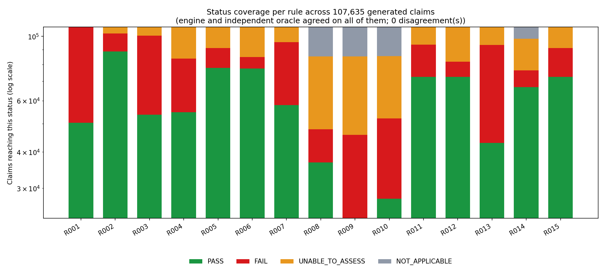

# 19 | Stress testing and judging coverage

Written 2026-09-26. Everything below is reproducible offline: `python -m unittest discover -s tests` (410 tests, about 60 s, no API key). The full suite (410 tests) passed on Python 3.10, 3.12 and 3.14, each in a clean clone, at commit `56611a3` (later commits change documentation only), and the audit cross-check of all 6,000 logged result hashes matched on all three.

## 1. What the judges score, and where it is checked

The weights are the mentor's proposals from `docs/07_Evaluation_and_Acceptance.md`.

| Area (weight) | What a judge inspects | Evidence | Known gap |
|---|---|---|---|
| **Rule correctness (35)** | Per-rule results; date, amount and authorization edge cases | All 9,000 public results at status accuracy 1.0 (`tests/test_stress_differential.py`, `AccuracyGateTests`). 123 hand-derived boundary cases, one step either side of every edge (`tests/test_stress_boundaries.py`). An independent oracle agreed with the engine on about 111,000 generated claims (section 2). | The mentor-held 200 claims are not available to us. |
| **Grounded AI explanations (20)** | 25 supplied cases plus fresh variants; no unsupported approvals | Schema and grounding checks now run in the orchestrator for every provider (`tests/test_stress_ai_boundary.py`, 17 misbehaviour kinds). 25 supplied and 11 own injection cases were run live (`outputs/llm_*`). | Manual 0/1 scoring of the live answers is not filled in. Live runs used prompt v1.3.0 on one model. |
| **Human review and usability (15)** | Trace a finding, dismiss with a reason, request info, trigger a recheck | `tests/test_review_workflow.py` (decisions, recheck as a new version). The review page filters by status and text and shows the evidence as submitted (`tests/test_stress_review_page.py`: hostile text stays inert). | The page records decisions in the browser and hands them over as a downloaded JSONL; applying them and running the recheck is a command-line step. There is no rule or severity dropdown. The mobile app and local API were parked. |
| **Uncertainty and security (15)** | Unknown data, malicious document text, tool errors, access boundaries | Unknown data: every rule has an UNABLE_TO_ASSESS path and none returns PASS for an unknown. Malicious text: all 9,000 verdicts on the 600 public claims are identical with injection text in every note and attachment. Tool errors: a crashing rule becomes UNABLE_TO_ASSESS, a failing model falls back to the template. | No authentication; reviewer identity is self-declared. |
| **Audit and reproducibility (10)** | Hashes and versions, audit history, repeatable install | Hash-chained log plus separate anchor (`tests/test_audit_log.py`). Every run now also records `engine_code_hash` (rule pack plus the two engine modules), because `rule_version` belongs to the rulebook and cannot tell two builds apart. `tests/test_stress_reproducibility.py` re-runs the engine on the 400 development claims and checks that all 6,000 result hashes in the committed audit sample still match. Fresh-clone install and the full suite pass with the README's own `uv` commands. Results are now the same on Python 3.10, 3.12 and 3.14. | Tamper-evident, not immutable (`docs/16`). |
| **Communication (5)** | Architecture, limitations, demonstration | README maps each rubric item to code and a command. | No team-authored architecture diagram, recorded demo or pitch yet. |

**Non-negotiable checks (docs/07)**

| Check | Test |
|---|---|
| No unimplemented or unknown check shown as a pass | `test_no_result_is_ever_not_implemented_or_an_unlisted_status`; the hidden-set runner tests (unknown policy, contract failure) |
| Each flagged issue links to source evidence and the rule | Same test asserts non-empty `evidence` and `corrective_action` on every FAIL and UNABLE; `rule_source` and `rule_version` are schema-required |
| A model failure cannot remove a deterministic finding | `test_every_deterministic_finding_survives_every_kind_of_model_misbehaviour` (17 kinds x 12 claims, also checks the audit log) |
| Original input preserved; a correction is rechecked as a new version | `test_recheck_creates_a_new_version_and_run_and_leaves_the_original_alone` |
| No real patient data, exposed credential or live payer submission | All data is synthetic. The key in the untracked `.env` appears in no commit and no tracked file; `.env` is git-ignored. There is no payer integration. |

**MVP items (docs/01)**: 1 ingestion `test_ingest.py`, `test_stress_ingest.py`; 2 all 15 rules with uncertainty and not-applicable outcomes; 3 result schema `test_phase1_rubric.py`; 4 review queue: see the gap above; 5 four decision actions `test_review_workflow.py`; 6 bounded AI with schema check and fallback `test_llm_adapter.py`, `test_stress_ai_boundary.py`; 7 tamper-evident audit `test_audit_log.py`; 8 evaluation `docs/17`.

## 2. How the rules were stressed

The 100% public score cannot show that the engine is right on data it has not seen, and it cannot show that the answer key's reading of an edge case is the only one. So the check is a second, independent implementation.

1. **Independent oracle** (`tests/oracle.py`, about 320 lines). Written only from the wording of `rules/rules.json` and `docs/04`. It imports nothing from the engine. It reproduces the answer key on all 9,000 public results, so it is a fair referee.
2. **Differential testing.** The engine and the oracle are run on generated claims and every status must match.
   - 37,000 boundary-aware mutants of real claims (dates one day either side, amounts at 0.01 and 0.02, wrong-case enums, null and empty ids, shared authorizations at and past their maximum).
   - 74,301 claims built from scratch, half fully random and half coherent-then-damaged, so PASS as well as every kind of FAIL and UNABLE is reached for each rule.
   - A disagreement is settled by re-reading the rulebook, not by editing whichever side is easier.
3. **Boundary table.** 123 cases with hand-derived expected statuses, including the ones a float or a banker's-rounding implementation gets wrong (`2.675 -> 2.68`, `0.125 -> 0.13`, `0.1 + 0.2`, one hundred lines of `0.1`).
4. **Metamorphic checks.** Shuffling lines and records, renaming ids, and putting instructions in notes and document text never change a status.
5. **Hostile inputs at every entry point:** a mentor-style JSONL file, FHIR bundles, CSV folders, the review page and the audit log (below).

### What it found (all fixed, each test red on the previous code)

| Area | Defect |
|---|---|
| R009 | A missing comparison input (for example a null `valid_to`) hid a proven mismatch (pending status, wrong patient, quantity over the shared maximum) as UNABLE_TO_ASSESS. The rulebook says a proven violation beats a missing input. |
| R013 | A null unit price hid a proven quantity violation (0, negative, over the limit). A whole-number float such as `3.0` was rejected as "not an integer". |
| R007, R012 | The submitted amount was rounded before the 0.01 tolerance (100.014 vs 100.00 passed). A huge valid amount overflowed the decimal context and was reported as an isolated tool error instead of a FAIL. |
| Rules, any Python | `date.fromisoformat` accepts `20261231` and the week date `2026-W52-4` from Python 3.11, so verdicts differed between a 3.10 and a 3.12 machine. Dates must now be exactly `YYYY-MM-DD`. |
| Runner | A UTF-8 BOM lost the first claim. An integer of more than 4,300 digits, deep nesting or one invalid byte aborted the whole run. A U+2028 inside a value split its own JSONL record. |
| Output and audit | The same U+2028 in a result or in a reviewer's reason made the repo's readers fail; after a reviewer pasted one, every later decision would have been rejected. Rows are now ASCII-escaped and readers split on `\n` only. |
| Ingestion | A malformed FHIR bundle raised out of `ingest()` and aborted the file. One text cell in a numeric CSV column, or an orphan row, quarantined the whole folder. An Excel BOM failed every CSV claim. `null` lines were dropped without a reason and crashed the summary. |
| AI boundary | `explain_with_fallback` trusted whatever a provider returned; schema and grounding checks lived only inside one provider class. A provider that edited the finding it was handed turned a FAIL into a PASS in the returned results. The orchestrator now validates every reply and hands providers copies. |

The 600 public claims are unaffected: status accuracy, precision and recall are still 1.0 on all three splits.

## 2b. Per-rule status coverage at scale, reproduced

A teammate ran an independent fuzzer at 107,635 generated claims and got a chart where R009 never once
reached PASS (every claim landed on FAIL, UNABLE_TO_ASSESS or NOT_APPLICABLE). That is not an engine or
rule defect: R009's PASS state needs five fields to agree on one claim at once (patient id, service code,
status exactly `approved`, the service date inside `valid_from`/`valid_to` inclusive, and the shared
quantity within `max_quantity`), and a fuzzer that sets every field independently at random can go
100,000+ tries without ever landing all five together, purely from the odds. The public data shows PASS
is real and common (287 of 600 claims), so the question was only whether our own generator's method
(half the claims seeded from a fully valid claim and then damaged, `tests/claim_gen.py`) reaches it too,
at the same scale.

`python scripts/status_coverage.py` reruns exactly that: 107,635 claims from `tests/claim_gen.random_claim`,
scored by both the engine and the independent oracle, with a hard failure if the two ever disagree.

| Rule | PASS | FAIL | UNABLE_TO_ASSESS | NOT_APPLICABLE |
|---|---|---|---|---|
| R001 | 50,440 | 57,195 | 0 (none by design) | 0 |
| R002 | 88,667 | 13,636 | 5,332 | 0 |
| R003 | 53,745 | 46,712 | 7,178 | 0 |
| R004 | 54,795 | 29,105 | 23,735 | 0 |
| R005 | 77,891 | 13,181 | 16,563 | 0 |
| R006 | 77,509 | 7,360 | 22,766 | 0 |
| R007 | 58,009 | 37,355 | 12,271 | 0 |
| R008 | 36,817 | 11,044 | 37,460 | 22,314 |
| R009 | 23,627 | 22,179 | 39,515 | 22,314 |
| R010 | 27,639 | 24,589 | 33,234 | 22,173 |
| R011 | 72,575 | 20,937 | 14,123 | 0 |
| R012 | 72,568 | 9,190 | 25,877 | 0 |
| R013 | 43,021 | 50,345 | 14,269 | 0 |
| R014 | 66,943 | 9,467 | 21,704 | 9,521 |
| R015 | 72,514 | 18,558 | 16,563 | 0 |

107,635 claims scored (108,726 generated, 1,091 would be quarantined at ingestion), **0 engine/oracle
disagreements**. Every rule reaches every status it can reach by design (R001 has no UNABLE_TO_ASSESS
path; only R008, R009, R010 and R014 can be NOT_APPLICABLE), including R009 PASS at 23,627 claims. Raw
counts: `outputs/status_coverage.json`.

## 3. Readings adopted where the rulebook is silent

Each is implemented the same way in the engine and the oracle, and covered by a test.

1. **Proven violation beats missing input**, in every rule (`docs/04`, shared conventions).
2. **"Empty" means null or whitespace-only text**, the supplied baseline's own convention. Identifier and enum comparisons are exact and case sensitive (`Active` is not `active`, `sar` is not `SAR`).
3. **Quantity must be a positive whole number.** `3.0` counts as whole, `1.5` does not. JSON does not distinguish them, and the pack's own `csv_to_jsonl.number()` turns `2.0` into `2`.
4. **Amounts are compared exactly**, not rounded first: `|submitted - round_half_up(expected)| <= 0.01`. Counter-evidence, recorded so this reads as a choice: the supplied `engine_core.money()` rounds any value, and the previous engine applied it to the submitted amount too. The two readings differ only when the exact difference falls in (0.010, 0.015), for example 100.014 against 100.00, which no public claim contains. We kept the exact reading because `docs/04` says not to repair source data before checking.
5. **NaN, Infinity and wrong-typed numbers are unknown**, and R001 reports them as missing information. They are not valid JSON numbers, and flagging them for a human is the conservative reading.
6. **Dates are exactly `YYYY-MM-DD`**; compact, week and time-suffixed spellings are unknown.
7. **R014 with any unknown service date is UNABLE_TO_ASSESS**: the unknown date could be the latest one and change the lag.
8. **A service code outside the catalogue** makes R008, R009 and R010 UNABLE_TO_ASSESS for that line (the rulebook: "Unknown service codes ... leave UNABLE_TO_ASSESS"), unless another line proves a FAIL.

## 4. Not covered

- The mentor-held 200 claims and their labels. The public-split perfect scores are not evidence of generalization; the oracle agreement is the closest substitute, and it shares one reader (us) with the engine.
- The oracle and the engine were written by the same team from the same text. Where both misread the rulebook the same way, only the answer key on the 600 public claims would notice.
- Live model behaviour on fresh variants. The AI tests use in-process providers; the live runs are recorded in `outputs/`.
- Concurrency beyond the existing 3-process audit test, performance beyond a 5,000-line claim (0.3 s) and a 300-claim file, and browsers other than the ones the review page was built for.
