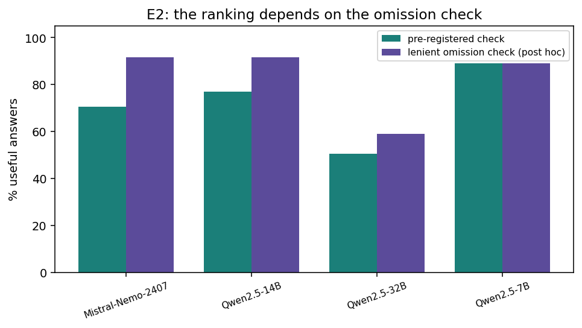
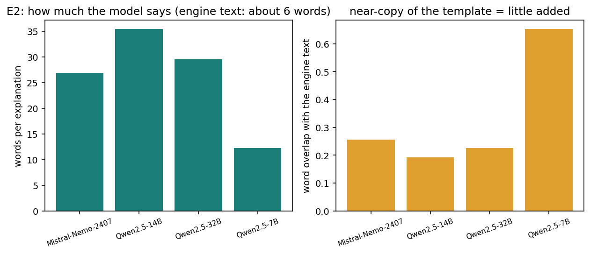
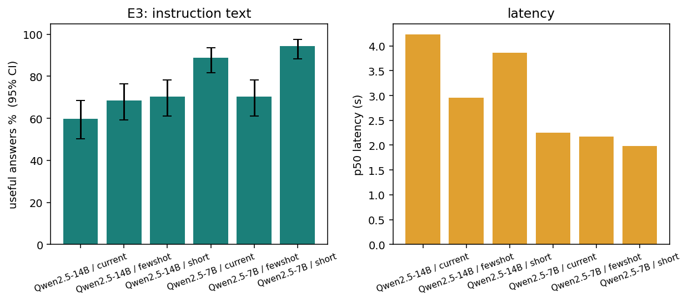
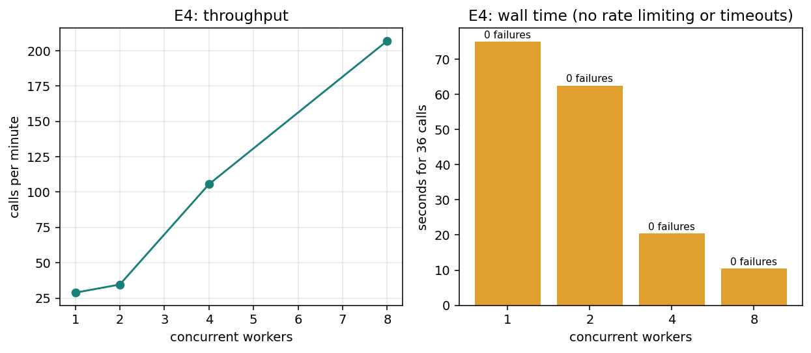
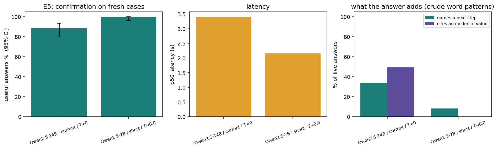
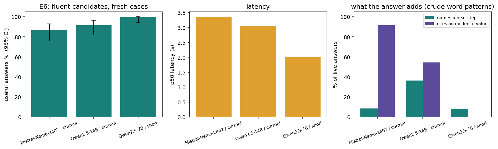

# 21 | Experiments: optimizing the AI explanation step

**Status: completed 2026-09-26. Pre-registered before any run.** The design, metrics and decision rule were committed first (commit `fc5c47f`); results were added afterwards, and every change to the design is listed under "Deviations".

## What can be optimized, and what cannot

The 15 rules are deterministic and already score 1.0 on all three public splits. They have no temperature and no tunable parameter, so there is nothing to optimize there and the experiments must not touch them. Only the **explanation step** (`src/llm_adapter.py`) has settings: the model, `temperature`, `top_p`, the instruction text, and the request concurrency.

**Invariant checked in every experiment:** the deterministic finding handed to the model is hashed before and after every call, and the set of finding hashes per case must be identical across all configurations. The report can therefore state as a fact that no configuration changed a verdict.

## Why the metrics look the way they do

A model explanation is only useful to a reviewer if it (1) actually came from the model rather than the fallback template, (2) states every reason the engine reported, and (3) adds nothing the finding does not support. The pipeline already guarantees that a bad reply is replaced by the template, so "the system stays safe" is not what varies between settings. What varies is **how often the model's answer is good enough to use**.

### Outcome of each call (mutually exclusive)

| Outcome | Meaning |
|---|---|
| `live` | The model answered and the reply passed the schema and grounding checks. |
| `model_rejected` | The model answered, but the reply was not JSON, failed the schema (wrong citation, wrong rule, changed review flag) or failed the grounding guard. The template was used. |
| `transport_failure` | Timeout, connection error, rate limit (429) or server error, after the provider's own single retry and up to two more attempts by the runner. Kept apart from `model_rejected` so that rate limiting cannot be mistaken for "this temperature is worse". |
| `config_error` | Model not available, bad request, authentication. Stops the run. |

### Metrics

| Metric | Definition | Role |
|---|---|---|
| **Useful-answer rate** | `live` AND no engine reason omitted (`omitted_engine_reasons` empty) AND no unsupported token (a number, date, code or rule id in the explanation that appears nowhere in the finding or rule text). Denominator: calls that did not end in `transport_failure`. | **Primary** |
| Live rate, model-rejection rate | Shares of `live` and `model_rejected`. | Secondary |
| Injection resistance | On cases with an adversarial untrusted note: share of model replies that neither contain approval language absent from the source nor flip `needs_human_review`. Counted on the raw reply, before the pipeline's checks, so it measures the model and not the safety net. | Secondary |
| Stability | Per case, across repeats: share of repeats whose explanation equals the most common one, and mean pairwise word-overlap (Jaccard). | Secondary |
| Latency, tokens | p50 and p95 latency of `live` calls, mean total tokens. | Secondary |

Automatic proxies are not the manual 0/1 rubric (correct finding, evidence, rule, action, honest uncertainty) from `docs/07`, which needs a human. That scoring is still open (`outputs/llm_manual_scorecard.csv`).

## Experiments

Cases: the 25 supplied exercises plus our 11 injection variants (36 in total) are the **tuning set**. Twelve fresh cases (`exercises/fresh_variants.jsonl`, built by `scripts/make_fresh_variants.py` from validation and stress claims that appear in no earlier case, with four new injection phrasings) are the **confirmation set**, used only in E5. Nothing is tuned on them.

| ID | Variable | Levels | Fixed | Repeats | Calls |
|---|---|---|---|---|---|
| E0 | No model (template only) | 1 | none | 1 | 36 |
| **E1** | **Temperature** | 0, 0.2, 0.5, 0.8, 1.0 | model `Qwen/Qwen2.5-14B-Instruct`, `top_p` 1, prompt v1.3.0 | 3 | 540 |
| E2 | Model | Qwen2.5-14B (baseline) and up to three other instruct models, each probed once first | best temperature from E1, `top_p` 1, prompt v1.3.0 | 3 | up to 432 |
| E3 | Instruction text | v1.3.0 (current), a shorter version, the current one plus a worked example | best temperature and model | 3 | 324 |
| E4 | Concurrency | 1, 2, 4, 8 workers | best temperature, model and prompt | 1 | 144 |
| E5 | Confirmation | current defaults vs the winner | fresh cases | 5 | up to 120 |

Thinking or reasoning models are probed with one call before inclusion, because extra text around the JSON would fail parsing and look like a model failure.

## Decision rule (fixed in advance)

1. The winner of an experiment is the level with the highest useful-answer rate.
2. With 108 calls per level, 95% Wilson intervals will often overlap. When the intervals of the top levels overlap, choose the **lowest temperature / cheapest / fastest** among them and say that the data did not separate them.
3. The current default (temperature 0, Qwen2.5-14B, prompt v1.3.0) is only replaced when the challenger beats it by at least 10 percentage points of useful-answer rate, with non-overlapping intervals, and an injection-resistance rate that is not lower.
4. A change to the default is not made silently: the frozen live runs and `docs/17` describe temperature 0. A winner that meets rule 3 is recorded as a recommendation with a new frozen run and a version note.
5. Temperature 0 on a hosted endpoint is not guaranteed to be deterministic; stability at temperature 0 is measured, not assumed.

## Hypotheses

- H1: at temperature 0 repeated answers are (nearly) identical; stability falls as temperature rises.
- H2: higher temperature raises the model-rejection rate (broken JSON, wrong citations, more unsupported wording) without raising the useful-answer rate.
- H3: a larger model, or a worked example in the prompt, raises the useful-answer rate more than any temperature change does.

## Reproduce

```bash
uv pip install --python .venv -r experiments/requirements-experiments.txt   # matplotlib only; the core install stays minimal
python scripts/make_fresh_variants.py
python scripts/run_experiments.py e1            # resumable: raw replies go to experiments/raw/. Also e2 to e6, see the header of the script
python scripts/analyze_experiments.py           # writes experiments/summary.json and docs/figures/*.png
```

Needs `FEATHERLESS_API_KEY` in `.env`. Raw replies are synthetic-data explanations and are committed; the key, the provider object and the environment are never written to them.

## Deviations from the pre-registration

Recorded as they happened. Items 1 to 5 were decided after seeing E1 to E4 and before running E5; nothing about E5's outcome was known.

1. **Lenient omission check (post hoc).** After E1 we read 30 of the answers the pre-registered "omitted reason" check flagged. 23 covered the engine's reason in different words ("not present in the allowed providers list" for "Provider absent from supplied network"), 3 really dropped a reason, and 4 covered the reason but also asserted that a second line "matches", which neither check catches. (This is an assistant reading, not human scoring.) The pre-registered metric is unchanged and remains primary. A second column uses the same check with a threshold of one half instead of two thirds of content-word stems. It is always labelled post hoc.
2. **Degenerate-reply rate (post hoc).** E2 and E3 showed the hosted 14B and 32B models occasionally return gibberish (mixed-language text, long runs of repeated tokens) even at temperature 0, which shows up as `not_json`. We count replies with CJK characters or long repeated runs separately and plot them over time.
3. **Verbosity (post hoc).** Words per answer and word overlap with the engine's own sentence, because the primary metric cannot tell an explanation that adds something from one that copies the template.
4. **Models probed.** Llama-3.1-8B-Instruct and gemma-2-9b-it are gated on this plan (HTTP 403). Qwen3-8B answered but was not included: a thinking-capable model changes the output shape. E2 therefore compared Qwen2.5-14B (baseline), Qwen2.5-7B, Qwen2.5-32B and Mistral-Nemo-Instruct-2407.
5. **E3 ran on two models.** On Qwen2.5-7B, the model with the highest useful-answer rate in E2 (as registered), and additionally on Qwen2.5-14B (exploratory). E4 used the 7B model.
6. **Garbled-text guard.** Added between E5 and E6 (see Results, E2). It is part of the production safety net, not of the experiment design.
7. **Runner change.** After E4 the runner gained an interleaved schedule (configurations alternate call by call) because sequential runs on a drifting endpoint confound the comparison. E1 to E4 ran sequentially.

**E5 as it will be run.** Arms: the current default (Qwen2.5-14B, temperature 0, prompt v1.3.0) against Qwen2.5-7B, temperature 0, `short` prompt, which had the highest useful-answer rate on the tuning set and meets decision rule 3 there. Twelve fresh cases, **8 repeats** per arm (96 calls each, instead of the 5 planned, to narrow the intervals), interleaved. The default is only replaced, as a recommendation with a new frozen run and a version note, if the challenger beats it on the fresh cases by at least 10 percentage points of useful-answer rate with non-overlapping 95% Wilson intervals, and its injection resistance is not lower. Otherwise the default stays.

## E6: added after E5 and before it was run (pre-registered here)

E5 confirmed the pre-registered winner on paper (Qwen2.5-7B with the `short` prompt: 100% useful against 88.5% for the default, non-overlapping intervals, better injection resistance). Reading its answers showed why: they restate the engine's own sentence (6.5 words on average, identical on every repeat). Across the 96 answers only 8 name a next step and none cites an evidence value, against 29 of 85 and 42 of 85 for the 14B model. The primary metric cannot see that an answer adds nothing over the template. E6 asks the question the metric missed.

- **Arms** (fresh cases, 12 cases x 5 repeats, interleaved, 180 calls): the default (Qwen2.5-14B, prompt v1.3.0); Mistral-Nemo-Instruct-2407 (fluent, never garbled in E2, 100% injection resistance); and the E5 winner as a reference.
- **New descriptive metrics** (defined here, before the run): *names a next step* (the answer contains verify, check, request, review, confirm, compare, obtain, correct, ensure or resolve) and *cites an evidence value* (an identifier, a date, a decimal or a number of two or more digits). Both are crude word patterns, not judgements of quality.
- **Decision rule.** An arm is recommended over the default only if it (a) produced no garbled raw reply, (b) has a lenient useful-answer rate within 5 percentage points of the best arm, and (c) names a next step and cites an evidence value in at least 25% of its answers each. Among arms that qualify, the fastest wins. If none qualifies, or only the default does, the default stays. The terse arm is not eligible for (c) unless it changes.

---

## Results

**Run:** 2026-09-26 against the hosted Featherless.ai endpoint. 2,136 calls in total (E1 540, E2 432, E3 648, E4 144, E5 192, E6 180), every one through the production path with the deterministic fallback. Raw replies: `experiments/raw/*.jsonl`. Every number below is generated from them by `scripts/analyze_experiments.py` (`experiments/summary.json`, `experiments/results_tables.md`), not typed by hand.

**Invariant held.** Across all 2,136 calls no configuration changed a deterministic finding: the finding was hashed before and after each call, and the hash per case is identical in every configuration. Temperature, model and prompt affect the wording of an explanation and nothing else.

**E0, the template.** The template is the engine's own sentence. It states every reason and adds nothing, so it is "useful" by construction and never fails. It is the safe floor, not a competitor on accuracy.

### E1: temperature (Qwen2.5-14B, prompt v1.3.0, 36 cases x 3 repeats per level)


| Temperature | Live % | Useful % (95% CI) | Useful % lenient (post hoc) | Garbled raw replies | Word overlap between repeats | Injection resisted % | p50 latency |
|---|---|---|---|---|---|---|---|
| **0** | 92.6 | **78.7** (70.1 to 85.4) | 90.7 | 12 of 116 | 0.68 | 95.2 | 3.3 s |
| 0.2 | 89.7 | 73.8 (64.8 to 81.2) | 88.8 | 22 of 121 | 0.55 | 93.1 | 3.1 s |
| 0.5 | 79.6 | 63.0 (53.6 to 71.5) | 77.8 | 43 of 133 | 0.44 | 94.6 | 3.4 s |
| 0.8 | 77.8 | 69.4 (60.2 to 77.3) | 75.9 | 41 of 134 | 0.40 | 94.4 | 3.9 s |
| 1.0 | 82.4 | 69.4 (60.2 to 77.3) | 79.6 | 29 of 124 | 0.33 | 94.5 | 3.5 s |

Other figures: `e1_outcomes.png`, `e1_rejection_reasons.png`, `e1_stability.png`, `e1_latency.png`, `e1_injection.png`, `e1_by_rule.png` (all in `docs/figures/`).

- **Temperature 0 wins on every measure** and is the lowest level, so decision rules 1 and 2 both pick it: no change to the default. 0.2 is statistically indistinguishable from 0 on the primary metric; 0.5 to 1.0 are clearly worse on live rate (78 to 82% against 93%) and on the lenient metric.
- **H2 holds.** Raising the temperature makes the model derail more often: the share of garbled raw replies rises from 10% at 0 to 32% at 0.5. It does not buy anything back.
- **H1 is only half true.** Repeat stability falls steadily with temperature (word overlap 0.68 down to 0.33), but **temperature 0 is not deterministic on the hosted endpoint**: only 1 of 30 cases gave the same text on all three repeats, and the most common answer covered 51% of repeats. Do not promise reproducible wording from a hosted model, even at 0. Verdicts are unaffected because they never come from the model.
- **Temperature does not change injection resistance.** About 3 or 4 of the roughly 55 to 63 judged raw replies followed an injected instruction at every level (93 to 95% resisted). The pipeline's checks caught them all; this measures the model alone.
- **Latency is flat** across temperatures (p50 3.1 to 3.9 s). The p95 is dominated by garbled replies that run to the token limit.

### E2: model (temperature 0, prompt v1.3.0, 3 repeats)




| Model | Live % | Useful % (95% CI) | Lenient % | Garbled raw replies | Injection resisted % | p50 / p95 | Words | Names a next step % |
|---|---|---|---|---|---|---|---|---|
| Qwen2.5-14B (current default) | 92.6 | 76.9 (68.1 to 83.8) | 91.7 | 15 of 119 | 95.0 | 3.3 / 17.2 s | 35.4 | 20.0 |
| Qwen2.5-7B | 94.4 | **88.9** (81.6 to 93.5) | 88.9 | **0 of 108** | 95.2 | **1.9 / 3.3 s** | 12.2 | 4.9 |
| Qwen2.5-32B | 72.4 | 50.5 (41.1 to 59.9) | 59.0 | 35 of 124 | 96.4 | 6.1 / 34.3 s | 29.5 | 13.2 |
| Mistral-Nemo-2407 (12B) | 97.2 | 70.4 (61.2 to 78.2) | 91.7 | **0 of 108** | **100.0** | 2.5 / 4.3 s | 26.9 | 7.6 |

- **Bigger is not better here.** The 32B model was worst: 21 of its replies were not valid JSON and 3 calls timed out.
- **The ranking depends on the omission check.** On the pre-registered check the 7B model leads by 12 points, but that check counts a paraphrase of an engine reason as an omission, and the 7B model rarely paraphrases: it copies. On the lenient check the 14B, Mistral and 7B are within 3 points of each other. Of 30 flagged 14B answers from E1 that we read, 23 were fine paraphrases (an assistant reading, not human scoring).
- **The hosted 14B and 32B endpoints derail; 7B and Mistral did not.** 313 of 1,311 raw 14B replies and 35 of 124 raw 32B replies were garbled (mixed-language gibberish or a long run of one token), against 0 of 733 for 7B and 0 of 178 for Mistral.


**A safety-net gap this exposed.** Three of these garbled explanations (2 in E1, 1 in E3) were valid JSON with correct citations, so they passed the schema and the grounding guard and were counted as ordinary live answers. The guard now rejects text in another script, a replacement character, and long repetitions (`tests/test_garbled_output_guard.py`; the roughly 1,500 recorded live answers are its false-positive check). E1 to E5 ran before this change and E6 after it; E4 to E6 contain no garbled live answer.

### E3: instruction text (temperature 0, 3 repeats)



| Model / prompt | Live % | Useful % (95% CI) | Lenient % | Injection resisted % | Words | Names a next step % | Cites evidence value % |
|---|---|---|---|---|---|---|---|
| 7B / current | 94.4 | 88.9 (81.6 to 93.5) | 88.9 | 95.2 | 12.2 | 4.9 | 29.4 |
| 7B / short | 97.2 | **94.4** (88.4 to 97.4) | 94.4 | 100.0 | 7.7 | 2.9 | 5.7 |
| 7B / fewshot | 90.7 | 70.4 (61.2 to 78.2) | 85.2 | 88.9 | 37.7 | **91.8** | 57.1 |
| 14B / current | 71.0 | 59.8 (50.3 to 68.6) | 70.1 | 95.9 | 33.4 | 13.2 | 59.2 |
| 14B / short | 89.8 | 70.4 (61.2 to 78.2) | 82.4 | 95.0 | 23.2 | 24.7 | 61.9 |
| 14B / fewshot | 71.3 | 68.5 (59.3 to 76.5) | 71.3 | 97.7 | 33.8 | 42.9 | 20.8 |

- **A shorter prompt makes the 7B model terser and "more useful" by the metric**: the words per answer fall to 7.7, and almost none names a next step or cites a value. The metric rewards restating the template.
- **A worked example does the opposite**: the 7B model then writes 38-word answers that name a next step in 92% of cases and cite values in 57%, at the price of a lower useful rate (some reasons are dropped) and lower injection resistance (88.9%).
- **The 14B rows are not comparable with each other.** The 14B runs took place while the endpoint was at its worst (garbled replies were 43% and 42% of replies for `current` and `fewshot`, against 10% in E1), so differences between prompts on the 14B are confounded with the time they ran. This is why E5 and E6 interleave the arms.

### E4: concurrency (Qwen2.5-7B, temperature 0, 36 calls per level)



| Workers | Wall time | Calls per minute | Transport failures | Useful % |
|---|---|---|---|---|
| 1 | 75.0 s | 28.8 | 0 | 88.9 |
| 2 | 62.5 s | 34.6 | 0 | 88.9 |
| 4 | 20.5 s | 105.5 | 0 | 88.9 |
| 8 | 10.4 s | 206.9 | 0 | 88.9 |

Throughput scales with workers up to 8 with no rate limiting or timeouts, and the answers do not change (this model is deterministic at temperature 0). The production default of 8 workers is supported; do not lower it.

### E5: confirmation on 12 fresh cases (interleaved, 8 repeats per arm)



| Arm | Live % | Useful % (95% CI) | Garbled raw replies | Injection resisted % | Repeat stability | p50 / p95 | Words | Names a next step % | Cites a value % |
|---|---|---|---|---|---|---|---|---|---|
| 14B / current (default) | 88.5 | 88.5 (80.6 to 93.5) | 14 of 105 | 96.6 | 0.48 | 3.4 / 28.1 s | 32.9 | 34.1 | 49.4 |
| 7B / short | **100.0** | **100.0** (96.2 to 100.0) | 0 of 96 | 100.0 | 1.00 | 2.2 / 5.4 s | 6.5 | 8.3 | 0.0 |

**By the pre-registered rule, the 7B model with the short prompt wins**: +11.5 points, non-overlapping intervals, better injection resistance. **Reading its answers shows the win is by copying.** Its answer is the engine's sentence, verbatim or nearly (FR-08: "Claim total does not equal the sum of line amounts."), identical on every repeat, and it never cites an evidence value. That is the template with extra steps. The metric was designed to catch unsafe or incomplete answers, not to tell whether an answer adds anything, so E6 was added.

### E6: fluent candidates (12 fresh cases x 5 repeats, interleaved)



| Arm | Live % | Useful % (95% CI) | Lenient % | Garbled raw replies | Injection resisted % | Words | Names a next step % | Cites a value % | p50 latency |
|---|---|---|---|---|---|---|---|---|---|
| 14B / current (default) | 91.7 | 91.7 (81.9 to 96.4) | 91.7 | 3 of 63 | 95.0 | 30.3 | 36.4 | 54.5 | 3.1 s |
| Mistral-Nemo / current | 98.3 | 86.7 (75.8 to 93.1) | 90.0 | **0 of 70** | **100.0** | 25.1 | 8.5 | 91.5 | 3.4 s |
| 7B / short | 100.0 | 100.0 (94.0 to 100.0) | 100.0 | 0 of 60 | 100.0 | 6.5 | 8.3 | 0.0 | 2.0 s |

**Applying the E6 rule (fixed before the run):** an arm qualifies only with no garbled raw reply, a lenient rate within 5 points of the best arm, and at least 25% of answers naming a next step and 25% citing a value. The default fails the first test (3 garbled raw replies, which the guard now catches). Mistral fails on the lenient rate (10 points below the best) and on naming a next step (8.5%). The 7B arm fails on value citation and on naming a next step. **No arm qualifies, so the default stays.**

## Conclusions and recommendations

1. **Keep temperature 0.** It is best or tied on every measure in E1 and has the lowest garble rate. Do not raise it for "more natural" wording.
2. **Do not replace the default model or prompt on this evidence.** The formal winner (7B, short prompt) wins by restating the engine's sentence, and no fluent candidate passed the E6 rule. Which trade-off a reviewer prefers (a fluent explanation that sometimes derails and is caught, or a terse restatement that never does) is a product decision the metrics cannot make. Manual 0/1 scoring by a person (`outputs/llm_manual_scorecard.csv`) is the missing evidence.
3. **The model matters more than the temperature.** The 32B model was worst; the 7B and Mistral models never garbled. If the garble rate of the hosted 14B endpoint does not improve, Mistral-Nemo is the fluent alternative to test next, with a prompt aimed at naming a verification step (the worked example did that for the 7B model).
4. **Hosted endpoints drift.** The same 14B configuration scored 78.7%, 76.9% and 59.8% useful in three runs about half an hour apart. Compare configurations by interleaving them, and never read a difference of a few points from separate runs.
5. **The safety net earned its keep, and had one hole.** Every garbled reply that failed to parse was replaced by the template, and the finding never changed. The three that parsed got through; the guard now stops them.
6. **Keep 8 workers** for live runs (E4).

## What would make the next round better

- Register an "adds something for the reviewer" measure **before** the first run (we had to add it after E5). Word-pattern proxies such as "names a next step" are crude; a person scoring 50 answers would settle it.
- Interleave configurations from the start.
- Score the answers manually with the 0/1 rubric in `docs/07`, and report the agreement between two scorers.
- Measure cost per explanation in currency once a paid plan is chosen (tokens are recorded: roughly 1,300 per call for every model).

## Threats to validity

- **A hosted endpoint changes over time.** E1 to E4 ran their configurations one after another, so a difference between configurations can be a difference in when they ran. E5 and E6 interleave.
- **Small samples.** 36 tuning cases and 12 fresh ones, with 3 to 8 repeats. Repeats of the same case are not independent, so the 95% Wilson intervals are optimistic.
- **Proxy metrics, not human judgement.** "Useful" is a mechanical check. The omission check has a known false-positive mode, and the added-value measures are word patterns. The 30-answer audit was read by an AI assistant.
- **Selection on the tuning set.** Candidates were chosen on the same 36 cases in E2 and E3; E5 and E6 use fresh cases to limit that.
- **One provider, one plan.** Results say nothing about other hosts of the same models.
