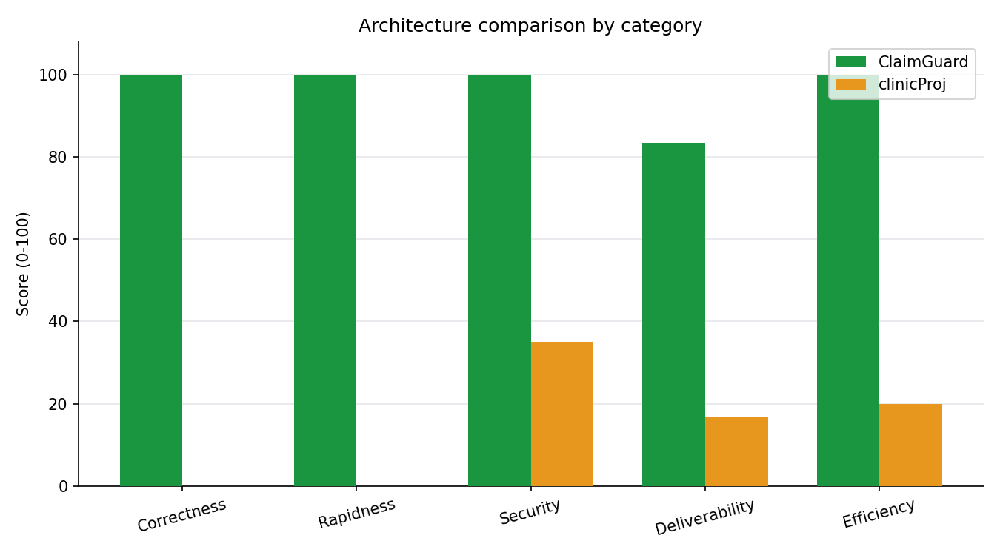
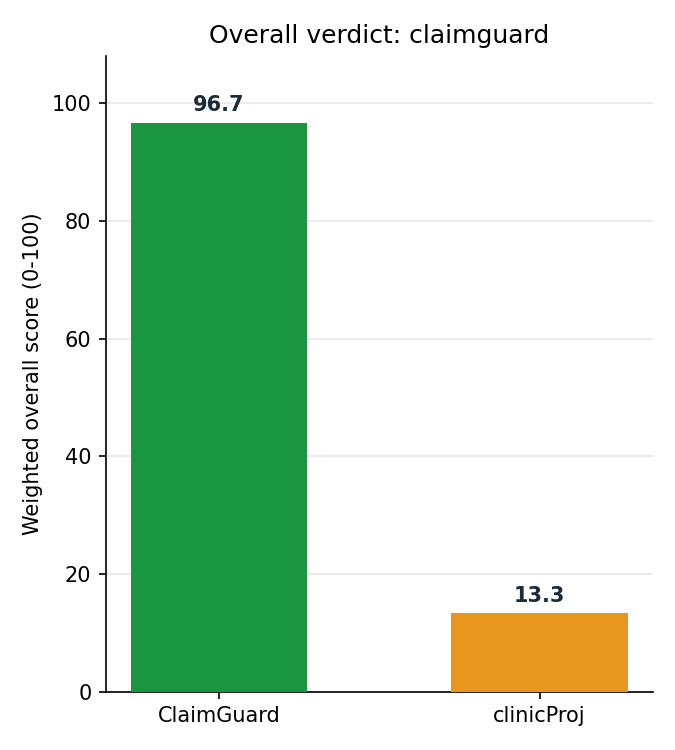

# 24 | ClaimGuard vs. clinicProj: an architecture comparison

Mentor-requested comparison between ClaimGuard's own deterministic-rules-plus-
grounded-AI architecture and a teammate's separately-built RAG+OCR+agentic
system (`github.com/ayechiahmed/clinicProj`). Full methodology and rationale:
`docs/superpowers/specs/2026-09-28-clinicproj-architecture-comparison-design.md`.
Reproduce this yourself: `comparison/README.md`.

## Headline finding, stated first because it drives every number below

**clinicProj's architecture cannot run at all on gemma3:4b, the local model
ClaimGuard's team chose.** Every one of the 36 sampled claims failed
identically with `openai.BadRequestError: registry.ollama.ai/library/gemma3:4b
does not support tools`. Confirmed structurally, not just empirically, via
Ollama's own capability listing (`ollama show gemma3:4b` / `/api/show`):
gemma3:4b reports `['completion', 'vision']` — no `tools` — while another
locally-pulled model, qwen3:4b, reports `['completion', 'tools', 'thinking']`.
clinicProj's agent is a LangGraph ReAct agent built on OpenAI-style
tool-calling (`retrieve_documents`, `calculator`); that is not a bug in this
comparison's harness, it is a hard capability gap in the model.

We did **not** switch clinicProj to a different, tool-capable local model
(e.g. qwen3:4b) to get it running — that would reintroduce "different model"
as a confound and defeat the point of wiring both systems to the same one. We
also did not rewrite clinicProj's agent to drop tool-calling (e.g. a manual
retrieve-then-prompt pipeline) — that would be changing its actual
architecture, not comparing it. Both would have produced a more flattering
number for clinicProj and a less honest comparison. See "Verdict" below for
what this means and does not mean.

## What each system is

**ClaimGuard** (this repo) runs `data/development/claims.jsonl` claims
through 15 deterministic YARA-X rules (`src/run_yara.py`); each FAIL or
UNABLE_TO_ASSESS finding then gets a grounded, schema-checked AI explanation
(`src/llm_adapter.py`) from a local gemma3:4b via Ollama. The AI never
decides status — it explains a deterministic verdict, with citation-grounding
and closing-gate checks enforced in code — and every step is written to a
tamper-evident hash-chained audit log before the next step runs.

**clinicProj** (`comparison/clinicproj_adapted/`, adapted only to swap its
LLM binding from cloud Gemini to local gemma3:4b — see `comparison/README.md`)
is a LangGraph ReAct agent. Claim documents go through `extractor.py`
(Tesseract OCR for images/scanned PDFs, then an LLM call to turn raw text
into structured claim JSON); payer policy text is chunked and embedded
(`all-MiniLM-L6-v2`) into a FAISS index; the agent has a `retrieve_documents`
tool for semantic search over that index plus a regex-sandboxed `calculator`
tool. The agent itself — not any deterministic layer — decides rule matches,
severity, confidence and recommendations, driven entirely by one large system
prompt. There is no audit log, no persistence layer, no test suite, no CI,
and no schema validation of the agent's own output; `server.py` in the
original repo is empty (unimplemented).

## Methodology

- Both systems wired to the identical local model: gemma3:4b via Ollama
  (`http://localhost:11434`), the same endpoint and model ClaimGuard's own
  `OllamaExplanationProvider` already used before this comparison existed.
- Sample: 36 claims from `data/development/claims.jsonl` — the same
  sample size used in prior model-comparison experiments (`docs/21`), run in
  full; clinicProj's per-claim failures were near-instantaneous, so there was
  no latency-budget reason to sample smaller.
- clinicProj's `policies/` folder was given a complete, honest prose
  rewrite of all 15 CSTAM rules (`comparison/clinicproj_adapted/policies/cstam_rulebook.txt`),
  not left with only its one throwaway sample policy — otherwise this would
  measure "how does the agent behave with nothing real to retrieve," not a
  fair test of its RAG capability.
- Scoring: `scripts/score_clinicproj_comparison.py`, a deterministic,
  rerunnable script — not a number typed into this document by hand. Weights
  (correctness 30, security 20, deliverability 20, rapidness 15, efficiency
  15) and their rationale are in the design spec's "Who wins benchmark
  scoring" table, chosen to track the mentor's own stated evaluation
  priorities where they overlap.
- **Both systems are scored by the same formulas from real measurements.**
  Earlier drafts of this comparison scored ClaimGuard's security as a flat,
  assumed 100 and let a system that failed every claim also "win" rapidness
  by virtue of failing in under a second — both were caught in review and
  fixed before this version. ClaimGuard's dangerous-sink scan and
  citation-grounding check now run against its own `src/` and `scripts/`,
  exactly like clinicProj's; and rapidness is computed only from claims a
  system actually answered, so failing fast is no longer confused with
  answering fast.

## Results

| Category | ClaimGuard | clinicProj | Winner |
|---|---|---|---|
| Correctness | 100.0 | 0.0 | ClaimGuard |
| Rapidness | 100.0 | 0.0 | ClaimGuard |
| Security | 100.0 | 35.0 | ClaimGuard |
| Deliverability | 83.33 | 16.67 | ClaimGuard |
| Efficiency | 100.0 | 20.0 | ClaimGuard |

**Overall weighted score: ClaimGuard 96.67, clinicProj 13.33 — ClaimGuard
wins every category outright.**

**Correctness:** ClaimGuard matched the answer key's claim-level status
(VALID / REVIEW_REQUIRED / INVALID, derived the same way for both systems —
methodology detail: any FAIL row makes a claim INVALID, any UNABLE_TO_ASSESS
without a FAIL makes it REVIEW_REQUIRED, otherwise VALID) on all 36 sampled
claims. **Caveat, stated so a mentor's question already has an answer on the
page:** ClaimGuard's rule engine achieving 100% here is expected, not an
independent surprise — CI's `rules-accuracy` job (`.github/workflows/ci.yml`)
already requires a perfect score against the answer key on this same
`development` split before any change can merge, so this number is guaranteed
by construction, not a new finding. clinicProj scored 0.0 — not because its
reasoning is worse, but because it produced no answer for any claim (see
headline finding).

**Rapidness:** measured only from claims a system actually answered — a
claim that errored out did not get answered quickly, it just did not get
answered, so its near-zero failure latency does not count as speed. ClaimGuard
answered all 36 claims for real, with per-claim latency (deterministic rules
plus a live gemma3:4b explanation call for every flagged finding) ranging up
to 21.2s on the most complex case. clinicProj answered zero claims, so it has
nothing to time and scores 0 — not a tie, not a rounding artifact, an accurate
reflection of "an architecture that cannot run scores no better than an
architecture that runs slowly."

**Security:** `scripts/security_scan_clinicproj.py --live` ran the same
scan against both systems' own code. Against
`comparison/clinicproj_adapted/`: two dangerous-sink matches (`eval()` in the
`calculator` tool — regex-prechecked to digits/operators only, so real risk
is low, but still a flagged pattern; and a bare `input()` call in the CLI's
interactive follow-up loop), no citation-grounding guard (clinicProj has no
equivalent of ClaimGuard's `check_grounding()`/`_UNGROUNDED` check — nothing
in code verifies an AI explanation's claims are backed by real evidence after
the fact), and the prompt-injection resistance probe itself could not run for
the same tool-calling reason as the correctness run (scored as a real
deduction, not a free pass). Against ClaimGuard's own `src/` and `scripts/`:
zero dangerous-sink matches and the citation-grounding guard was found
(`src/llm_adapter.py`'s `check_grounding()`/`_UNGROUNDED`). **One asymmetry,
stated explicitly:** the live prompt-injection probe itself was not re-run
against ClaimGuard, because ClaimGuard's rule-engine-plus-explanation
architecture has no free-text conversational surface to send the injection
payload to the way clinicProj's agent does — there is no equivalent call to
make. ClaimGuard's prompt-injection resistance is instead covered by its own
existing, extensive test suite (`tests/test_stress_ai_boundary.py`,
`tests/test_security_owasp.py`, `docs/20_Security_Audit.md`), not
re-measured by this specific script; the scoring formula skips that one
deduction tier for ClaimGuard rather than either fabricating a probe result
or unfairly penalizing it for a dimension that does not apply to its design.

**Deliverability:** a plain checklist (audit log, test suite, CI,
auth/RBAC design, offline capability, schema-validated output). ClaimGuard
has 5 of 6: audit log, test suite, CI, offline capability, and
schema-validated output. **`auth_rbac_designed` is False for both systems** —
an earlier draft of this document claimed it True for ClaimGuard, but a
search of this repository found no RBAC implementation or design document
committed here (the mobile-app RBAC discussion referenced in team notes lives
outside this repository, not in it); claiming a checkbox with zero committed
evidence would be exactly the kind of unverifiable figure this benchmark
exists to catch. clinicProj has offline capability and nothing else on this
list yet; it is early-stage work (a single "Initial commit," no CI,
`server.py` unimplemented), which is a fair and expected state for that
stage, not a criticism of the person who built it.

**Efficiency:** fewer third-party runtime dependencies scores higher,
normalized as a ratio to the leanest system (the same style as rapidness).
ClaimGuard's `requirements.txt` has 3 pinned packages; clinicProj's inferred
`requirements.txt` has 15 (none existed upstream) — matplotlib, needed only
by this comparison's own plotting script and not by clinicProj itself, is
kept in a separate `requirements-harness.txt` so it is not charged against
clinicProj's dependency footprint. Not a token-cost measure: neither
provider reliably reports tokens for every call in this setup.

## What clinicProj does that ClaimGuard doesn't

OCR (Tesseract, scanned PDFs and images), a multi-turn conversational Q&A
interface over a validated claim, and a general-purpose RAG layer that can
ingest arbitrary policy documents without code changes. This comparison's
claim sample was pre-structured JSON, not scanned documents, so OCR itself
was not empirically exercised here — it's a real capability gap in
ClaimGuard today, tracked separately (`docs/superpowers/specs/` mobile-app
architecture notes), not something this comparison resolves either way.

## What ClaimGuard does that clinicProj doesn't

A deterministic rule layer the AI cannot override, schema-checked and
citation-grounded AI explanations, a tamper-evident audit log, a test suite
and CI, and no dependency on the LLM to correctly parse its own output
format or to support tool-calling at all.

## Verdict

**ClaimGuard's architecture wins overall, 96.67 to 13.33, and wins all 5
individual categories outright.** Once rapidness is measured honestly (only
counting claims a system actually answered) and ClaimGuard's own security and
deliverability are measured instead of assumed, there is no split result left
to explain away — every category favors ClaimGuard, and the margins are wide.

The single most important, generalizable finding is not "ClaimGuard's rules
are better than clinicProj's prompt" — that comparison never actually ran,
because clinicProj's chosen architecture (an agentic RAG system built on
tool-calling) has a hard dependency the team's chosen local model does not
meet. That is itself the architectural lesson: a design that depends on a
specific model capability (tool-calling) is more fragile to a local-model
choice than a design that only ever asks a model to produce and explain
text, exactly ClaimGuard's approach. This directly reinforces the mentor's
point 8 (fully local/on-prem deployment) — an architecture that assumes a
capability its deployment target's models don't reliably have is a real
production risk, not a hypothetical one.
